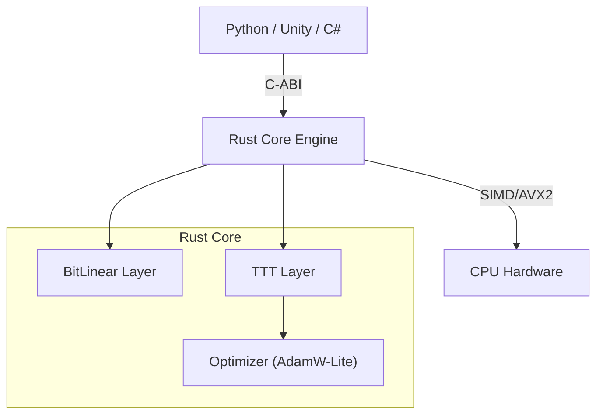

# Bit-TTT Engine Architecture

## 1. Core Philosophy (設計思想)

**Bit-TTT** aims to bridge the gap between "Ultra-efficient Inference" and "Adaptive Learning".
We combine two cutting-edge technologies into a single, portable runtime:

1.  **1.58-bit Quantization (BitNet b1.58)**:
    *   Parameters are ternary `{-1, 0, 1}`.
    *   Multiplication is replaced by Addition (SIMD-friendly).
    *   Drastically reduces memory footprint and energy consumption.

2.  **Test-Time Training (TTT)**:
    *   Instead of static attention KV-cache, we treat the hidden state as a "Fast Weight" machine learning model.
    *   The model "learns" the current context on-the-fly via gradient descent.
    *   This allows simpler linear complexity inference with infinite context potential.

---

## 2. System Overview (システム構成)

The project is structured as a **Hybrid Architecture** to maximize performance and usability.

### Component Details

| Module | Role | Key Tech |
|---|---|---|
| **bit_linear** | Matrix Multiplication | Ternary Weights, SIMD packing, `popcnt` instruction |
| **ttt_layer** | Sequence Modeling | Online Gradient Descent, Fast Weights Update |
| **c_api** | Interoperability | `extern "C"`, Error Codes, Raw Pointers |
| **bit_llama** | Reference App | Llama-like structure using Bit-TTT components |

---

## 3. Data Flow (データフロー)

### Inference Step (TTT-Forward)
1.  **Input**: Token ID sequences.
2.  **Embedding**: Lookup float vector.
3.  **Core Update**: 
    *   Calculate Reconstruction Loss (Self-Supervised).
    *   Update `W_state` (Fast Weight) using Gradient Descent.
    *   This effectively "compresses" the history into `W_state`.
4.  **Projection**: Transform latent state to output features.
5.  **Output**: Next token logits.

---

## 4. Safety & Stability (安全性)

*   **No Panic Policy**: All C-ABI functions return `BitTTTError` codes.
*   **Safety Comments**: All `unsafe` blocks are documented with preconditions.
*   **CI/CD**: Automated testing (Cargo Test) and auditing (Cargo Audit) on every push.
