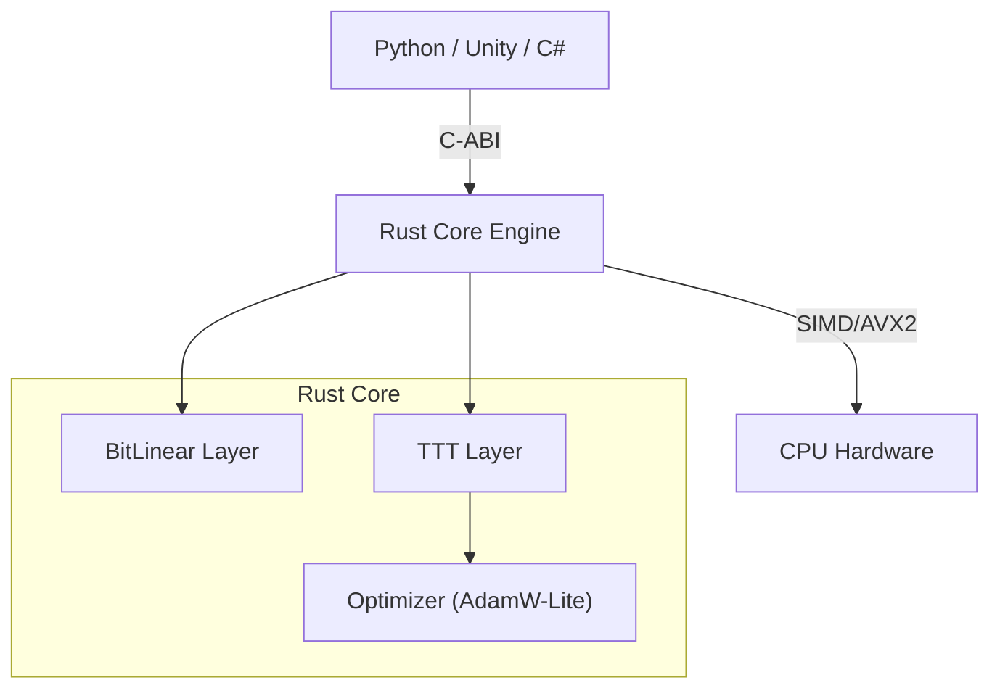

# Bit-TTT Engine アーキテクチャ

## 1. Core Philosophy (設計思想)

**Bit-TTT** は、「超高効率な推論（Ultra-efficient Inference）」と「適応的な学習（Adaptive Learning）」の融合を目指すプロジェクトです。
以下の2つの先端技術を単一のポータブルなランタイムに統合しています。

1.  **1.58-bit 量子化 (BitNet b1.58)**:
    *   パラメータを三値 `{-1, 0, 1}` に制約します。
    *   高負荷な「乗算（Multiplication）」を「加算（Addition）」に置き換え、SIMD演算との親和性を高めます。
    *   メモリ使用量と消費電力を劇的に削減します。

2.  **Test-Time Training (TTT)**:
    *   従来の静的なKVキャッシュの代わりに、隠れ状態（Hidden State）を「Fast Weight（高速な重み）」を持つ機械学習モデルとして扱います。
    *   モデルは入力された文脈（コンテキスト）をその場で勾配降下法（Gradient Descent）を用いて「学習」します。
    *   これにより、推論時の計算量を線形（Linear Complexity）に抑えつつ、理論上無限のコンテキストを扱える可能性を秘めています。

---

## 2. System Overview (システム構成)

性能と使いやすさを最大化するため、**ハイブリッド・アーキテクチャ**を採用しています。

### コンポーネント詳細

| Module | Role | Key Tech |
|---|---|---|
| **bit_linear** | 行列演算 (Layer) | 三値重み, SIMDパッキング, `popcnt` 命令 |
| **ttt_layer** | 系列モデリング | オンライン勾配降下法, Fast Weights 更新 |
| **c_api** | 外部インターフェース | `extern "C"`, エラーコード, 生ポインタ管理 |
| **bit_llama** | リファレンス実装 (App) | Bit-TTTコンポーネントを用いたLlamaライクな構造 |

---

## 3. Data Flow (データフロー)

### 推論ステップ (TTT-Forward)
1.  **Input**: トークンIDの系列を受け取ります。
2.  **Embedding**: IDを浮動小数点のベクトルに変換します。
3.  **Core Update**: 
    *   再構成誤差（Reconstruction Loss）を自己教師あり学習として計算します。
    *   勾配降下法を用いて `W_state` (Fast Weight) を更新します。
    *   これにより、過去の文脈情報は `W_state` の中に「圧縮」されていきます。
4.  **Projection**: 潜在状態を出力特徴量に変換します。
5.  **Output**: 次のトークンの確率分布（Logits）を出力します。

---

## 4. Safety & Stability (安全性)

*   **No Panic Policy**: すべての C-ABI 関数は、パニックせずに `BitTTTError` エラーコードを返します。
*   **Safety Comments**: すべての `unsafe` ブロックには、安全性が担保される条件（事前条件）が明記されています。
*   **CI/CD**: プッシュごとに自動テスト（Cargo Test）とセキュリティ監査（Cargo Audit）が実行され、品質を保証します。
