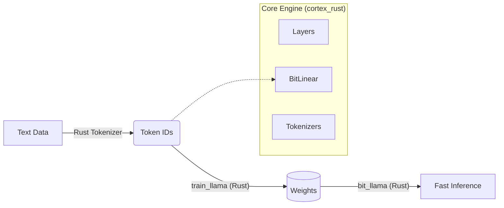

# Bit-TTT Engine: High-Performance Brain Core

**1.58-bit Quantization + Test-Time Training (TTT)** Implementation in Rust.
This engine powers the next generation of efficient, adaptive AI models.

[Japanese / 日本語](README_JA.md) (See separate file)

---

# 🇬🇧 English: Bit-TTT Engine

## Overview
**Bit-TTT Engine** is a high-performance implementation of the Bit-TTT architecture. It combines **1.58-bit quantization efficiency** with **Test-Time Training (TTT)** adaptability. It uses the **Candle** framework for tensor operations and runs as a **Pure Rust** ecosystem (with optional Python integration via PyO3).

📘 **[Read the Architecture Design](ARCHITECTURE.md)** to understand the core philosophy.

## Features
*   **End-to-End Rust Pipeline (NEW!)**: Complete lifecycle support (Tokenization -> Training -> Inference) purely in Rust. No Python required.
*   **Rust-First & Python-Compatible**: Core logic in Rust for speed, exposed to Python via PyO3 if needed.
*   **Zero-Copy Inference**: Efficient data handling between Rust and Python.
*   **Device Support**: Supports **CPU** (AVX optimized) and **CUDA** (GPU) execution.
*   **Pure Rust Mode**: Can be compiled as a standalone binary without Python dependencies.
*   **Safe**: Strict adherence to Rust safety guarantees.

## Architecture: Pure Rust Ecosystem



## Project Components

- **[`rust_engine/`](rust_engine/)**: The core implementation (`cortex_rust`).
    - `core_engine.rs`: Candle-based neural network logic.
    - `lib.rs`: Public API exports.
- **[`bit_llama/`](bit_llama/)**: Standalone Rust binary for training/inference.

## Quick Start (Pure Rust CLI) 🚀

You can now train and run inference entirely without Python!

### 1. Build
```bash
cd bit_llama
cargo build --release --features cuda
```

### 2. Training (train_llama)
Trains a model from scratch using the `cortex_rust` engine.
```bash
# Verify config in src/bin/train_llama.rs first
cargo run --release --features cuda --bin train_llama
```
*Outputs: `bit_llama_checkpoint.safetensors`*

### 3. Inference (bit_llama)
High-performance streaming generation.
```bash
# Run with a model directory containing config.json, tokenizer.json, model.safetensors
../target/release/bit_llama --model ../models/dummy --prompt "Hello Rust AI" --temp 0.8 --max-tokens 100
```
*Performance: ~1100 tokens/sec (on CPU with dummy model)*

## Quick Start (Python)

### 1. Build & Install
Use `maturin` to build the Python wheel.

```bash
cd rust_engine
maturin develop --release
```

### 2. Usage
```python
import cortex_rust

# Configuration
config = cortex_rust.BitLlamaConfig(
    vocab_size=50257,
    hidden_dim=256,
    num_layers=4,
    inner_lr=0.01
)

# Load Model (Device: "cpu" or "cuda")
model = cortex_rust.BitLlama(config, "path/to/model.safetensors", device="cuda")

# Inference (Tokens)
tokens = [1, 50, 100]
logits = model.forward(tokens)
print(logits)
```

## Advanced Build Options

### Pure Rust Binary (No Python)
If you want to build a standalone Rust binary without linking to Python (e.g., for embedded deployment):

```bash
cargo build --release --no-default-features
```
(This disables the `python` feature flag in `Cargo.toml`).

### Device Selection
In `PyBitLlama`, you can specify the device:
- `device="cpu"` (Default if omitted)
- `device="cuda"` (Requires CUDA feature enabled and GPU)

---
*Created by Project Bit-TTT.*
