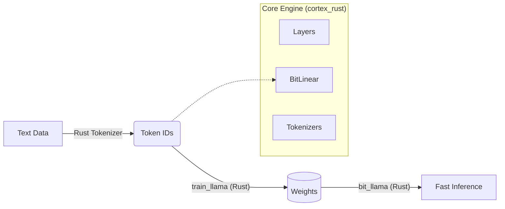

# Bit-TTT 脳エンジン: 高性能AIコア

**1.58-bit 量子化 + Test-Time Training (TTT)** のRust実装です。
次世代の効率的で適応力のあるAIモデルを支えるコアエンジンです。

[English](README.md) (英語はこちら)

---

# 🇯🇵 日本語: Bit-TTT Engine

## 概要
**Bit-TTT Engine** は、Bit-TTTアーキテクチャの高性能実装版です。**1.58bit量子化による効率性**と、**Test-Time Training (推論時学習) による適応性**を兼ね備えています。テンソル演算には **Candle** フレームワークを使用し、**完全なRust環境**で学習から推論までを実行できます（Pythonとの連携もオプションとしてサポート）。

📘 **[アーキテクチャ設計書](ARCHITECTURE_JA.md)** も参照してください。

## 特徴
*   **End-to-End Rust Pipeline (NEW!)**: データ処理、学習、推論のすべてを Rust のみで完結。Python は不要です。
*   **Rust-First & Python-Compatible**: 高速なRustコアロジックを PyO3 経由でPythonから利用可能。
*   **Zero-Copy Inference**: 非効率なデータコピーを排除し、高速な推論を実現。
*   **Device Support**: **CPU** (AVX最適化) および **CUDA** (GPU) での実行をサポート。
*   **Pure Rust Mode**: Python依存なしでコンパイル可能。組み込み用途に最適。
*   **Safe**: Rustの安全性保証に厳密に準拠。

## アーキテクチャ: Pure Rust エコシステム



## プロジェクト構成

- **[`rust_engine/`](rust_engine/)**: コア実装 (`cortex_rust`)。
    - `core_engine.rs`: Candleベースのニューラルネットロジック。
    - `lib.rs`: 公開 API 定義。
- **[`bit_llama/`](bit_llama/)**: 学習・推論用のスタンドアロンRustバイナリ。

## クイックスタート (Pure Rust CLI) 🚀

Pythonを一切使わずに、学習から推論までを実行できます！

### 1. ビルド
```bash
cd bit_llama
cargo build --release --features cuda
```

### 2. 学習 (train_llama)
`cortex_rust` エンジンを使用してゼロからモデルを学習します。
```bash
# 事前に src/bin/train_llama.rs の設定を確認してください
cargo run --release --features cuda --bin train_llama
```
*出力: `bit_llama_checkpoint.safetensors`*

### 3. 推論 (bit_llama)
高性能なストリーミング生成を実行します。
```bash
# config.json, tokenizer.json, model.safetensors があるディレクトリを指定
../target/release/bit_llama --model ../models/dummy --prompt "Hello Rust AI" --temp 0.8 --max-tokens 100
```
*パフォーマンス: ~1100 tokens/sec (CPU, ダミーモデル)*

## クイックスタート (Python)

### 1. ビルドとインストール
`maturin` を使用して Python wheel をビルドします。

```bash
cd rust_engine
maturin develop --release
```

### 2. 使い方
```python
import cortex_rust

# 設定
config = cortex_rust.BitLlamaConfig(
    vocab_size=50257,
    hidden_dim=256,
    num_layers=4,
    inner_lr=0.01
)

# モデル読み込み (デバイス指定: "cpu" または "cuda")
model = cortex_rust.BitLlama(config, "path/to/model.safetensors", device="cuda")

# 推論実行 (トークンID列)
tokens = [1, 50, 100]
logits = model.forward(tokens)
print(logits)
```

## 高度なビルドオプション

### Pure Rust Binary (Python依存なし)
Python連携を行わず、軽量なRust単体バイナリとしてビルドする場合：

```bash
cargo build --release --no-default-features
```
(`Cargo.toml` の `python` 機能を無効化します)

### デバイス選択
`PyBitLlama` のコンストラクタでデバイスを指定できます：
- `device="cpu"` (省略時のデフォルト)
- `device="cuda"` (CUDA環境が必要)

---
*Created by Project Bit-TTT.*
