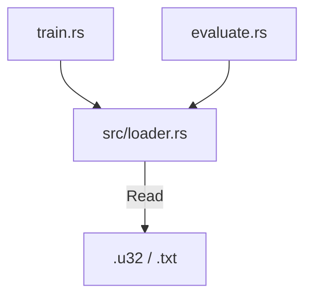
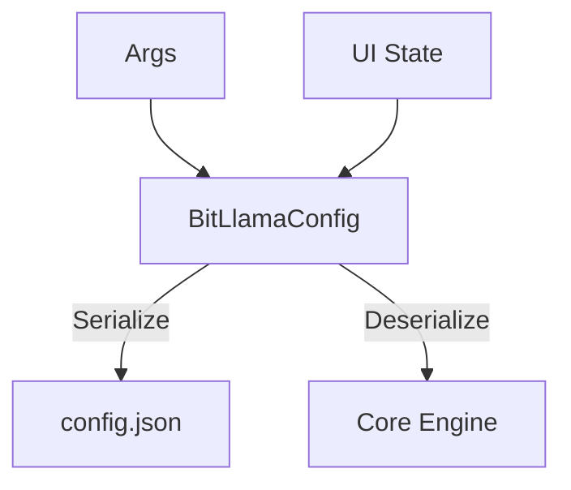

# Dependency Map: Phase C

## 1. Logging Architecture
```mermaid
graph TD
    Sources[Modules (Train/Gui/etc)] -->|tracing::info!| Subscriber[Tracing Subscriber]
    
    Subscriber -->|Layer 1| Stdout[Console Output]
    Subscriber -->|Layer 2| File[Log File (optional)]
    Subscriber -->|Layer 3| Channel[MPSC Channel]
    
    Channel -->|Receiver| GUI[GUI Log Window]
```

## 2. Data Loading Unification


## 3. Configuration Flow

