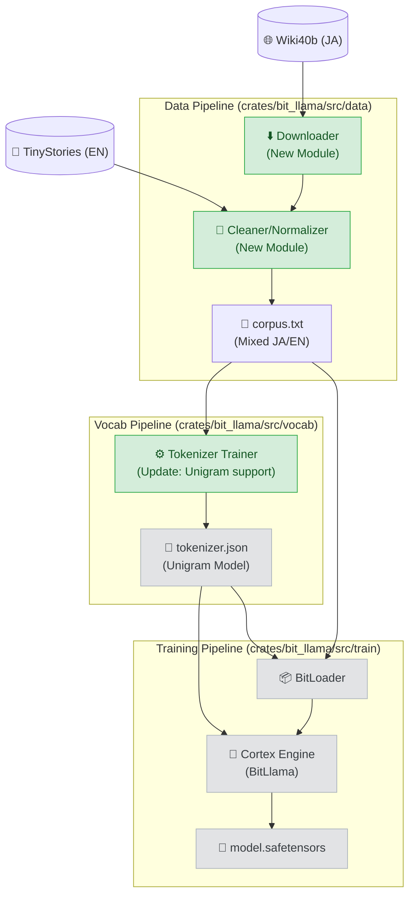

# Dependency Map: Phase 14 (Japanese Proficiency)

## 1. Component Flowchart

## 2. Risk Assessment (Impact Analysis)

| Component | Dependency Risk | Impact | Mitigation |
| :--- | :--- | :--- | :--- |
| **`vocab.rs`** | High | `tokenizer.json` の形式が変わると、推論時のデコード結果が化ける可能性がある。 | `Unigram` と `BPE` の共存、または明確なモード切替を実装する。 |
| **`BitLoader`** | Medium | 日本語文字コード (UTF-8) の境界でデータを分割すると文字化けするリスク。 | `BitLoader` は `u32` (Token ID) ベースなので影響なし。前処理段階 (`preprocess`) でのエンコードさえ正しければ安全。 |
| **GUI** | Low | トークナイザーの進捗表示機能などに影響。 | 既存のログストリーム (`mpsc`) を使用するため、大きな改修不要。 |

## 3. Critical Path
1.  **Data Downloader**: これがないとトークナイザーの学習が始まらない。
2.  **Unigram Support**: `tokenizers` クレートの設定変更。
3.  **Validation**: 生成されたトークンが妥当か（漢字がバラバラになっていないか）の確認。
