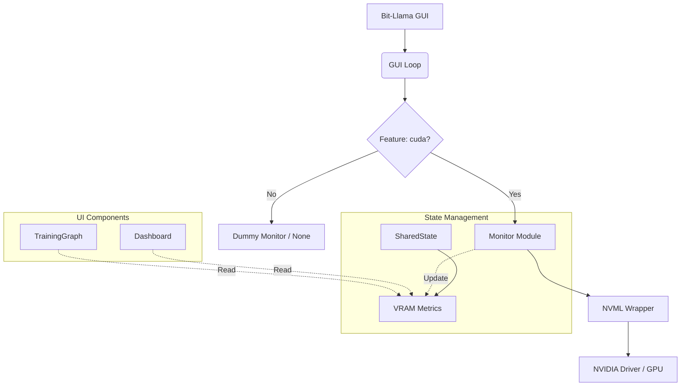

# Dependency Map: Phase C (VRAM Monitor)

## 1. Dependency Visualization (Mermaid)

## 2. Risk Assessment (Dependencies)

| Dependency | Impact | Risk | Mitigation |
| :--- | :--- | :--- | :--- |
| **`nvml-wrapper`** | Connects to NVIDIA Management Library | High (Linkage Error) | Wrap in `cfg(feature = "cuda")`. Graceful degradation if DLL missing. |
| **Running on CPU** | No GPU, No NVML | Low (Panic?) | Ensure runtime check `is_available()` before init. |
| **Build Time** | Linking external libs | Medium | Windows Path issues. Instructions in README. |
| **State Lock** | `SharedState` mutex contention | Low | Updates occur on separate thread or infrequent check (1Hz). |

## 3. Critical Path
1.  Add `nvml-wrapper` to `Cargo.toml`.
2.  Implement `Monitor` struct with `cfg` guards.
3.  Wire up `SharedState`.
4.  UI Display.
