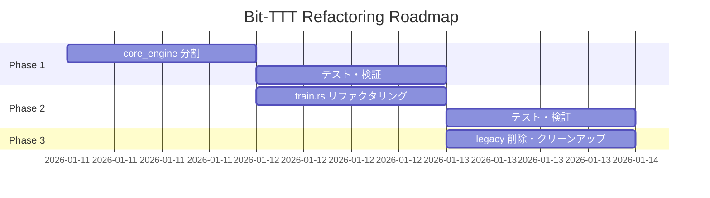

# ROADMAP.md - Bit-TTT リファクタリングロードマップ

**作成日**: 2026-01-11
**目的**: 実装フェーズの定義とリソース上限の設定

---

## フェーズ概要



---

## Phase 1: Core Engine モジュール分割 (MVP)

**目標**: `core_engine.rs` (1097行) を複数モジュールに分割

### タスク一覧

- [x] `rust_engine/src/layers/` ディレクトリ作成
- [x] `rms_norm.rs` 抽出 (RMSNorm)
- [x] `bit_linear.rs` 抽出 (BitLinear)
- [x] `swiglu.rs` 抽出 (SwiGLU)
- [x] `ttt.rs` 抽出 (TTTLayer)
- [x] `rust_engine/src/model/` ディレクトリ作成
- [x] `block.rs` 抽出 (BitLlamaBlock)
- [x] `llama.rs` 抽出 (Llama)
- [x] `python.rs` 抽出 (PyO3 バインディング)
- [x] `lib.rs` 更新 (`pub use` で互換性維持)
- [x] `cargo check`, `cargo test` 通過確認

### 期待成果

```
rust_engine/src/
├── layers/
│   ├── mod.rs, rms_norm.rs, bit_linear.rs, swiglu.rs, ttt.rs
├── model/
│   ├── mod.rs, block.rs, llama.rs
├── python.rs
└── lib.rs
```

---

## Phase 2: Train モジュールリファクタリング (Enhancement)

**目標**: `train.rs` (565行) の責務分離

### タスク一覧

- [x] `bit_llama/src/train/` ディレクトリ作成
- [x] `args.rs` 抽出 (TrainArgs)
- [x] `checkpoint.rs` 抽出 (save_training_state, load_start_step, find_checkpoint_path)
- [x] `training_loop.rs` 抽出 (メイン学習ループ)
- [x] `train.rs` を親モジュールに変換 (pub use 再エクスポート)
- [x] `cargo check --workspace` 通過確認

### 期待成果

```
bit_llama/src/train/
├── mod.rs
├── args.rs
├── checkpoint.rs
└── loop.rs
```

---

## Phase 3: クリーンアップ (Completion)

**目標**: 技術的負債の解消

### タスク一覧

- [x] `legacy/` モジュールの使用箇所確認
- [x] 使用箇所がなければ `legacy/` 削除
- [x] `lib.rs` から deprecated エクスポート削除
- [x] `cargo check --workspace` 通過確認

---

## タイムボックス (Circuit Breaker)

| Phase | 上限時間 | 超過時のアクション |
|-------|----------|---------------------|
| Phase 1 | 2時間 | 残りを次回セッションへ持ち越し |
| Phase 2 | 2時間 | スコープ縮小 (`checkpoint.rs` のみ) |
| Phase 3 | 1時間 | 延期可能 (必須ではない) |

---

## リソース制限

| リソース | 上限 |
|----------|------|
| 新規ファイル数 | 15ファイル以内 |
| 新規依存クレート | 0 (既存のみ使用) |
| API破壊的変更 | 0 (互換性維持) |

---

## 成功基準

1. **全テスト通過**: `cargo test --workspace`
2. **CI グリーン**: GitHub Actions 成功
3. **ファイルサイズ**: 各ファイル < 400行
4. **学習パイプライン動作**: スモークテスト成功

---

**本計画のレビュー後、Phase 1 から実装開始**
