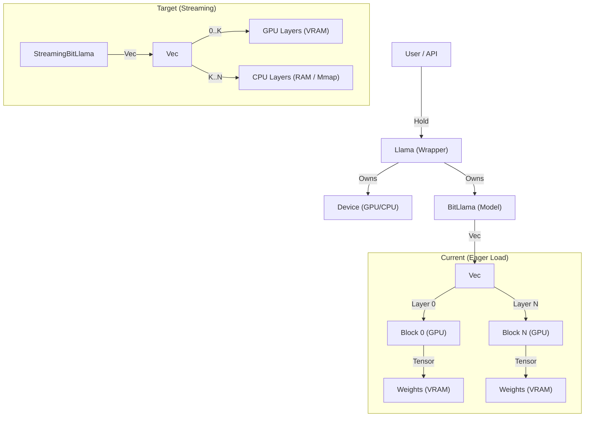

# Dependency Map (Phase 15)

## Class Hierarchy & Memory Ownership

## Critical Paths
1.  `Llama::new_with_weights` -> `BitLlama::load`
    - Must intercept here to allow partial loading.
2.  `BitLlama::forward_one`
    - Currently iterates cleanly.
    - Needs to inject "Move to GPU" logic before `layer.forward()`.

## Risks
- **Tensor cloning**: `tensor.to_device(gpu)` creates a copy. Code must perform this efficiently.
- **Latency**: Doing this per-token for every layer is extremely slow (PCIe bottleneck).
    - *Mitigation*: Current focus is "Make it Run" (Capacity), not Speed.
