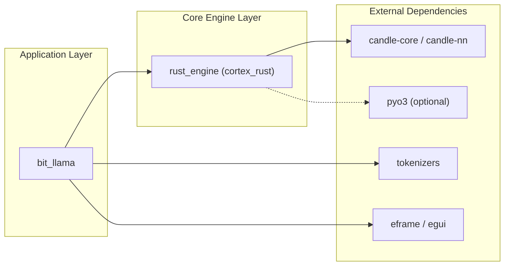
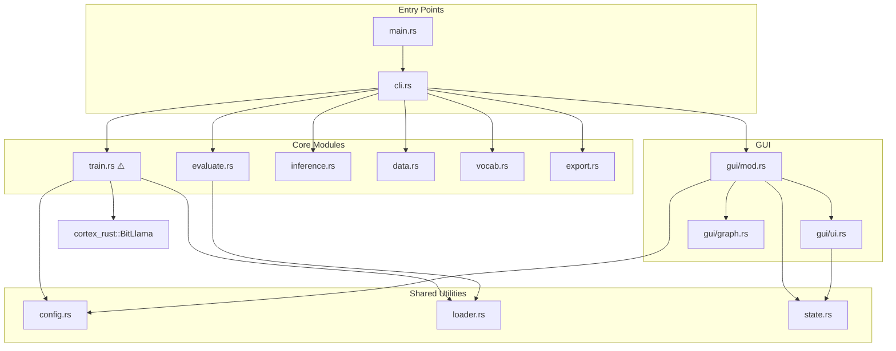
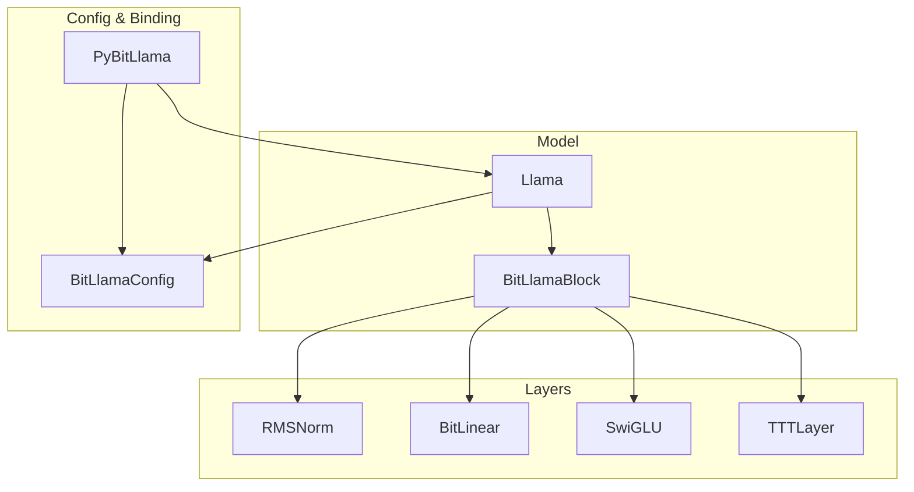

# DEPENDENCY_MAP.md - Bit-TTT 依存関係マップ

**作成日**: 2026-01-11
**目的**: 要素間の結合度と依存関係を可視化し、変更に伴うリスクを評価

---

## 1. クレート間依存関係



---

## 2. モジュール間依存関係 (bit_llama)



---

## 3. core_engine.rs 内部依存関係



---

## 4. 密結合部分 (Risk Assessment)

| 結合ポイント | 結合度 | リスク | 注意事項 |
|--------------|--------|--------|----------|
| `train.rs` → `cortex_rust::BitLlama` | **高** | モデルAPI変更時にtrain.rsも修正必要 | APIを安定化してから分割 |
| `gui/mod.rs` → `state.rs` | **高** | state構造変更はGUI全体に波及 | 段階的リファクタリング |
| `core_engine.rs` 内部 | **中** | 層(Layer)同士は疎結合 | 分割は比較的安全 |
| `legacy/` → 外部 | **低** | deprecated、使用箇所なし | 安全に削除可能 |

---

## 5. 変更副作用の予測

### Scenario A: `core_engine.rs` をモジュール分割

**影響範囲**:
1. `rust_engine/src/lib.rs` - `pub use` の更新必要
2. `bit_llama/src/train.rs` - `use cortex_rust::*` が動作すれば影響なし
3. PyO3バインディング - `#[pymodule]` の位置変更注意

**リスク**: 低-中（互換性維持が容易）

### Scenario B: `train.rs` を複数ファイルに分割

**影響範囲**:
1. `bit_llama/src/cli.rs` - `train::run()` の呼び出し先更新
2. `bit_llama/src/main.rs` - 特に影響なし
3. GUI - 現状は直接呼び出しなし

**リスク**: 中（学習ループは繊細）

---

## 6. クリティカルパス

```
User → CLI → train::run() → BitLlama::forward() → [TTTLayer, BitLinear] → Output
                  ↓
            CheckpointSave → .safetensors
```

**ボトルネック**: `train::run()` の巨大さがテスト・変更の障壁

---

**次のステップ**: Step 3 (Synergy Design) で効率化ポイントを特定
